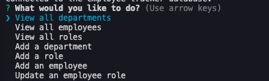

 

   

  # Employee-Tracker

  ## Description 
  The Employee Tracker allows users to track employees, departments, and roles. 

  

  ## Table of Contents

  * [Installation](#Installation)
  * [Usage](#Usage)
  * [Contributions](#Contributions)
  * [Testing](#Testing)
  * [License](#License)
  * [Questions](#Questions)

  ## Installation
  The user must clone the remote repository onto their computer and use the terminal to run the application.

  ## Usage
  To track employees, departments, and roles.

  ## Contributions
  No contributions.

  ## Testing 
  After cloning the remote repository onto your computer open in desired code editor and use the terminal on the app.js file to interact. Test the project by answering the prompt questions and creating a test search.

  ## License 
  This project has an MIT license.
  https://opensource.org/licenses/MIT

 
 ## Video Walkthrough
 https://watch.screencastify.com/v/6mfzVYjAPs2ebyjIKtN9
  

  ## Questions
  Need to reach me?
  * Email: michvalenz27@gmail.com
  * [GitHub](https://github.com/MichValenz/Employee-Tracker)

       